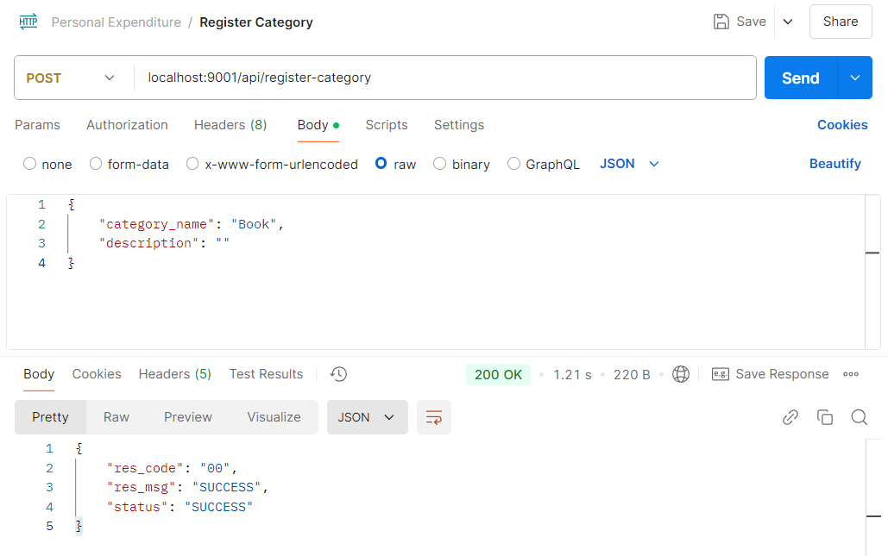
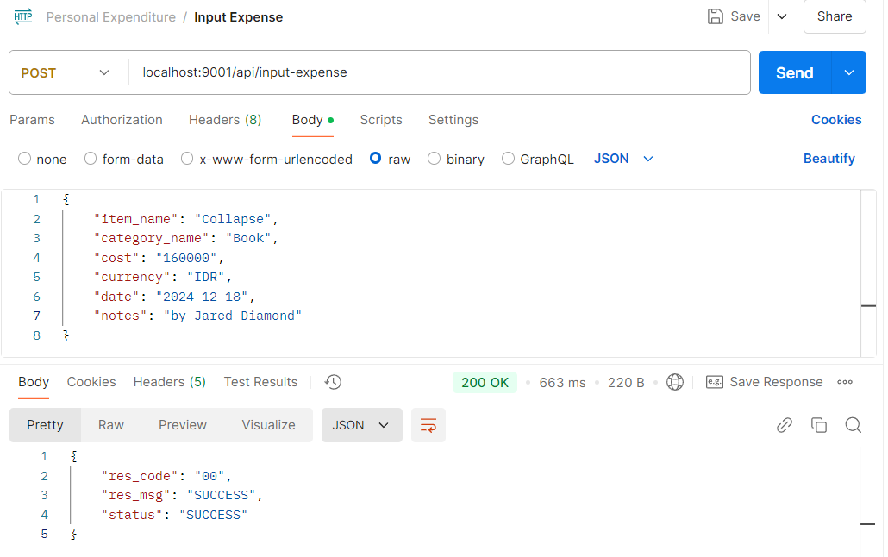
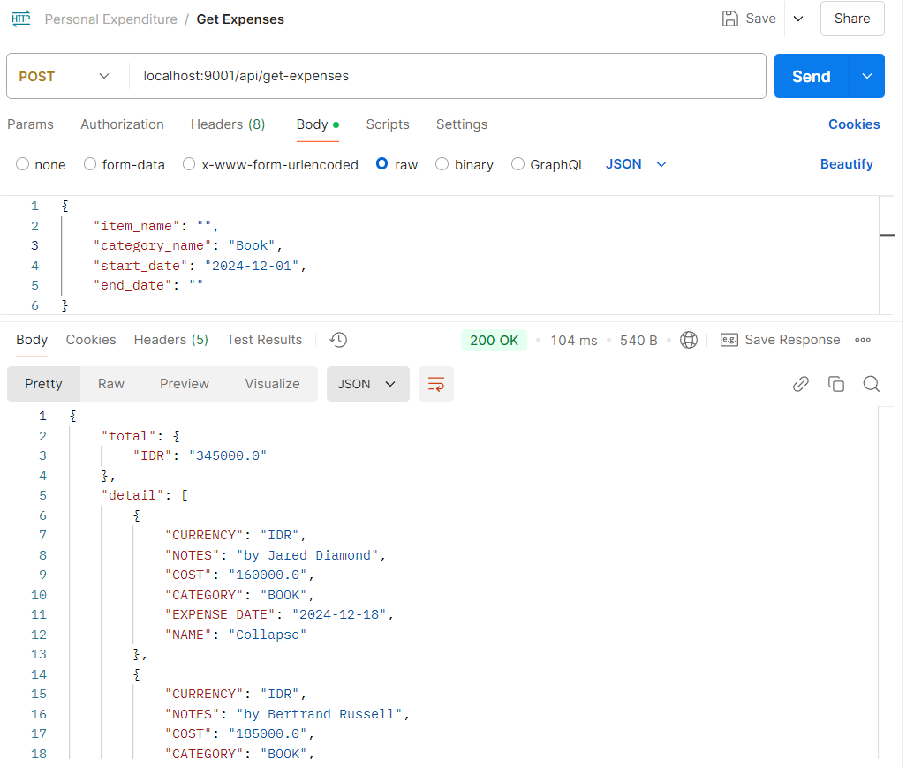

# personal-expenditure
Record your expenses! Don't let them go to Neverland.

This project was written in the Java programming language. It utilizes JDBC as its connection to the database.  
This project consist of **3 APIs**, as outlined below:  
**1. Register Category**  
    Categories must be registered before any expenses can be input. This step helps prevent disorganized data from being stored in the database.
     
**2. Input Expenses**  
    Users can enter any expense they have incurred. Don't worry if the expense is from a previous day—the date can be adjusted accordingly during each input.
   
**3. Get Expenses**  
    Retrieve the total amount of expenses, along with detailed information for each one. The expenses can be summarized by category, item name, or the date they were incurred.  

## License  
**All rights are reserved.** You may not use, distribute, or modify the code without explicit permission from the author.
